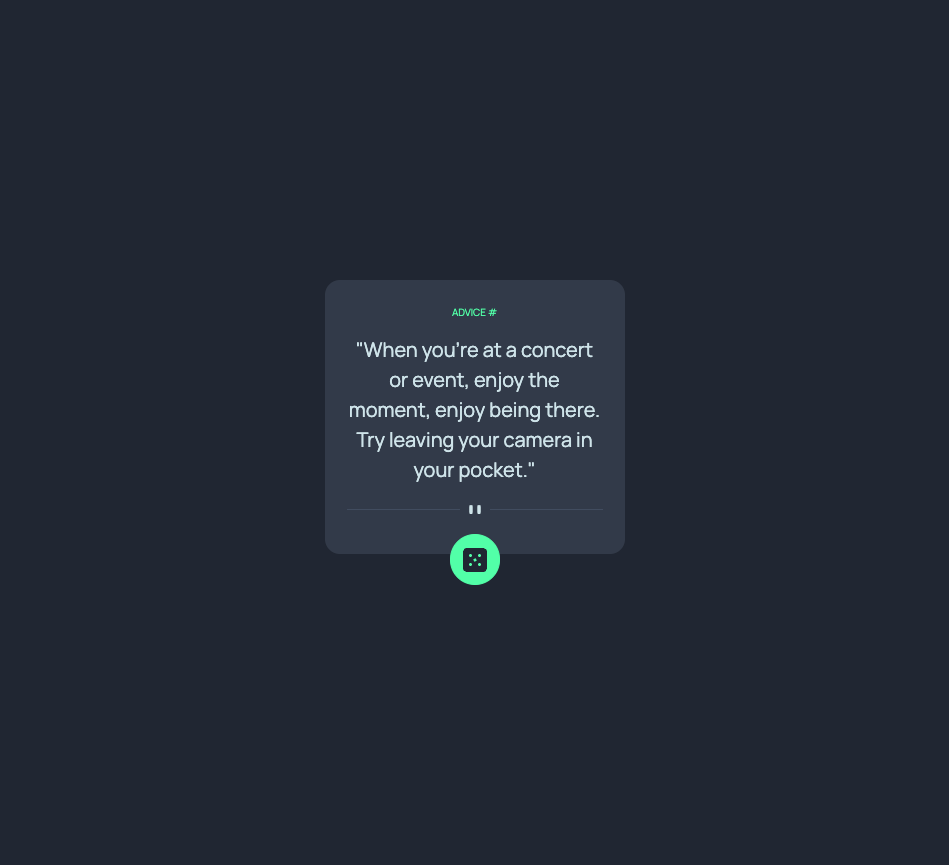

# Advice generator app 

## Table of contents

- [Overview](#overview)
  - [Screenshot](#screenshot)
  - [Links](#links)
  - [Built with](#built-with)
  - [What I learned](#what-i-learned)
- [Author](#author)

## Overview

Responsive design advice generator using the advice slip API.

### Screenshot

### Links

- Live Site URL: [Add live site URL here](https://your-live-site-url.com)

### Built with
- Flexbox
- Responsive workflow
- [React](https://reactjs.org/) - JS library
-[SlipAdvice API](https://api.adviceslip.com/) - API
-[BootStrap](https://getbootstrap.com/) - styling framework

### What I learned

This was a fun design to create. I enjoyed practicing buiding a React app and utilizing an API. I haven't used Bootstrap before, so this was a great learning experience.

## Author

- Website - [Heather Rouke](https://www.heatherrouke.com/)
- Frontend Mentor - [@heathervalene](https://www.frontendmentor.io/profile/heathervalene)
- GitHub - [@HVR_214](https://github.com/heathervalene)

